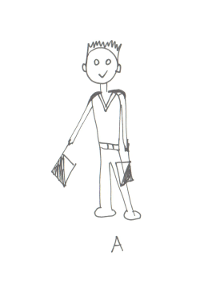
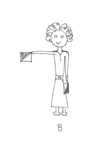
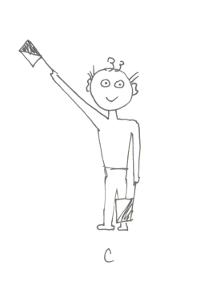
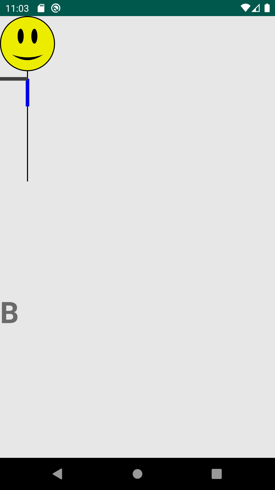

# AndroidDevChallenge

## Idea

**Flag Sam** is a fun game for children based on flag semaphore signals

Let us introduce Sam first. Sam is the main character of the game. He or she is helping kids (or adults) to learn the flag
alphabet first. Then they can use it in the game to get points or compete
with one another.

The app will recognize the position of the person from a live camera picture and detect the signal. Ideally it should work without flags too. Recognition is done with a help of a pose estimation vision model.

The app will use simple cartoon drawings and animations to show
detected movement of the person (instead of showing the real camera preview picture). Player can choose from various personas.

| Img1                                                | Img2                                                | Img3                                                |
| --------------------------------------------------- | --------------------------------------------------- | --------------------------------------------------- |
|       |       |       |
|  |  |  |

## Development

